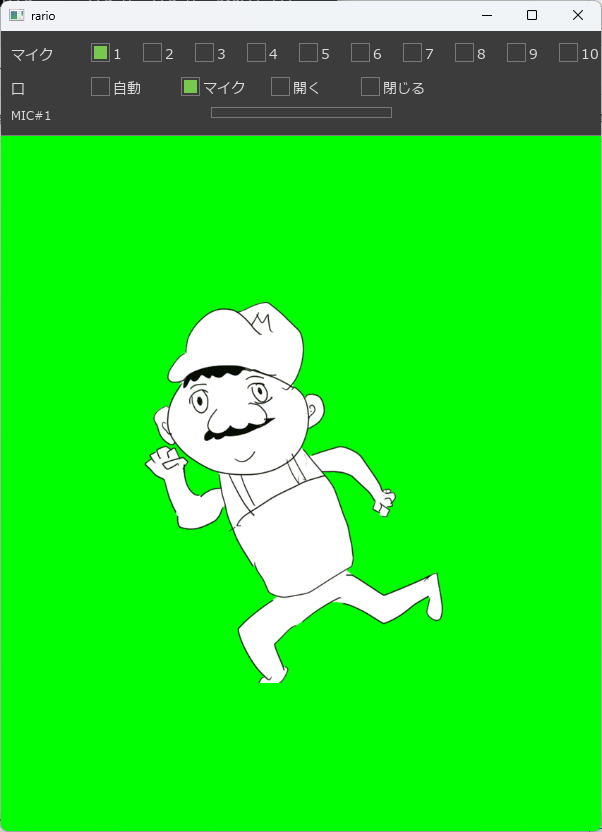
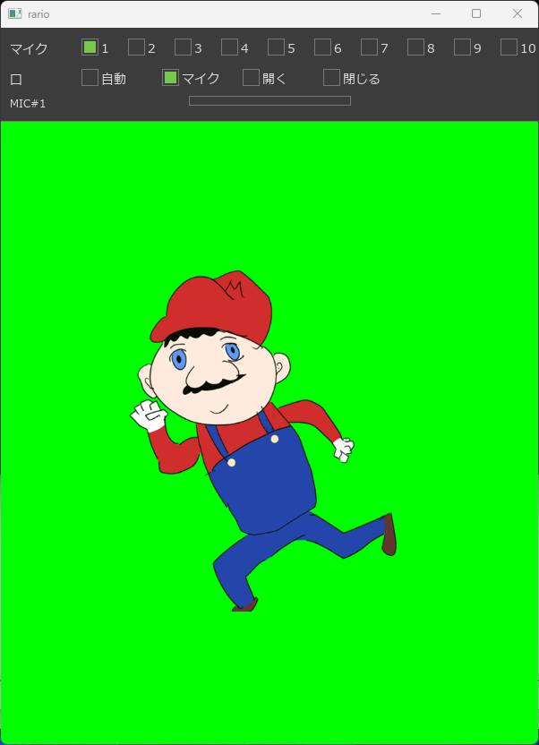

# ラリオなりきりツール

## ダウンロード
- ダウンロードはこちら！
  - [むらいっちゃんオリジナル](https://github.com/arnie-pj/muraichi-rario-narikiri/raw/refs/heads/main/muraichi-rario-narikiri_muraichi-original.zip)
  - [ろろさんカラー](https://github.com/arnie-pj/muraichi-rario-narikiri/raw/refs/heads/main/muraichi-rario-narikiri_rorosan-color.zip)

## 概要
- 労働村の村人1さんが配信でお絵描きされたキャラクター「ラリオ」の口パクが出来るソフトを開発しました
- むらいっちゃんの描いたオリジナル版、リスナーの1人ろろさんが着色されたカラー版を同梱！

<table><tr><td>
むらいっちゃんオリジナル（白） 

</td><td>
ろろさん着色カラー（綺麗） 

</td></tr></table>

## 操作方法
- 上部設定バーで操作します
  - マイク設定
    - マイクがいくつ接続されていても、必ず10つ表示されます
    - マイクに音を入れながら、何番のマイクが正しいかチェックしてください
    - 該当番号にマイクが接続されていない場合、エラーが表示されます
  - 口パク設定
    - 自動：勝手にずっと口パクします
    - マイク：マイクの音量を見て、口パクする／しないを切り替えます
    - 開く：常に口を開きっぱなしにします
    - 閉じる：常に口を閉じっぱなしにします

# クレジット
- 労働村の村人1さん
    - [YouTubeチャンネル](https://www.youtube.com/@%E5%8A%B4%E5%83%8D%E6%9D%91%E3%81%AE%E6%9D%91%E4%BA%BA1)
    - [Xアカウント](https://x.com/roudou1)
    - [このお絵描きをした配信](https://www.youtube.com/watch?v=khUi0-OB4hs)
- ろろさん
    - [Xアカウント](https://x.com/hiro_rogi_otk)

